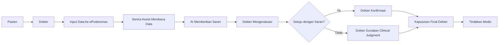

# Sentra Assist — Gambaran Umum Sistem

**Versi**: 1.0.0  
**Tanggal**: 11 Februari 2026  
**Penulis**: dr. Ferdi Iskandar  
**Target Pembaca**: Manajemen, Regulator, Auditor, Pimpinan Fasilitas Kesehatan

---

## Ringkasan Eksekutif

**Sentra Assist** adalah sistem Clinical Decision Support System (CDSS) berbasis Chrome Extension yang dirancang untuk membantu dokter dan tenaga kesehatan di Puskesmas Kota Kediri dalam proses pengambilan keputusan klinis. Sistem ini terintegrasi dengan Rekam Medis Elektronik (RME) ePuskesmas dan menggunakan **Iskandar Diagnosis Engine V1** untuk memberikan saran diagnosis diferensial berbasis gejala.

### Karakteristik Utama

- **Platform**: Chrome Browser Extension
- **Target Pengguna**: Dokter dan Tenaga Kesehatan Puskesmas
- **Deployment**: Puskesmas Kota Kediri, Dinas Kesehatan Kota Kediri
- **Model Operasi**: Assistive AI (Human-in-the-loop)
- **Knowledge Base**: 159 penyakit umum di layanan primer
- **Data Epidemiologi**: 45.030 kasus riil dari Puskesmas
- **Safety Model**: Multi-layer safety gates dengan red flags detection

---

## Apa itu Sentra Assist?

### Definisi

Sentra Assist adalah **alat bantu keputusan klinis** (assistive tool) yang:

1. **Membaca** data anamnesis dari ePuskesmas secara otomatis
2. **Menganalisis** gejala dan vital signs menggunakan AI
3. **Memberikan saran** diagnosis diferensial dengan confidence score
4. **Mendeteksi** kondisi emergensi (red flags) secara otomatis
5. **Mempercepat** entry data diagnosis dan resep ke ePuskesmas
6. **Mengecek** interaksi obat berbahaya (Drug-Drug Interaction)

### Tujuan Sistem

- ✅ Meningkatkan efisiensi pelayanan (hemat 3-5 menit per pasien)
- ✅ Mengurangi risiko missed diagnosis pada kasus umum
- ✅ Mendeteksi kondisi emergensi lebih awal
- ✅ Mencegah interaksi obat berbahaya
- ✅ Mendukung clinical reasoning dokter dengan evidence-based suggestions

---

## Apa yang BUKAN Sentra Assist?

> [!IMPORTANT]
> **Sentra Assist BUKAN**:

- ❌ **Bukan sistem diagnosis otomatis** — Tidak membuat diagnosis final tanpa persetujuan dokter
- ❌ **Bukan pengganti dokter** — Keputusan akhir tetap di tangan dokter
- ❌ **Bukan sistem otonom** — Tidak dapat beroperasi tanpa supervisi manusia
- ❌ **Bukan sistem komprehensif** — Hanya mencakup 159 penyakit umum di layanan primer
- ❌ **Bukan sistem medikolegal** — Tidak menghilangkan tanggung jawab klinis dokter

---

## Peran dalam Pengambilan Keputusan Klinis

### Model Human-in-the-Loop



### Prinsip Kerja

1. **Dokter tetap pengendali penuh** — Sistem hanya memberikan saran, tidak memutuskan
2. **Transparansi** — Setiap saran dilengkapi reasoning dan confidence score
3. **Verifikasi wajib** — Dokter harus verifikasi setiap data yang di-auto-fill
4. **Escalation protocol** — Red flags langsung disampaikan ke dokter untuk tindakan
5. **Audit trail** — Semua keputusan sistem tercatat untuk accountability

---

## Batasan Tanggung Jawab

### Tanggung Jawab Dokter

Dokter yang menggunakan Sentra Assist **bertanggung jawab penuh** atas:

- ✅ Verifikasi akurasi data yang di-auto-fill oleh sistem
- ✅ Keputusan diagnosis final
- ✅ Pemilihan terapi dan obat
- ✅ Keputusan rujukan
- ✅ Semua aspek medikolegal terkait perawatan pasien
- ✅ Dokumentasi klinis yang memadai

### Tanggung Jawab Sistem

Sistem Sentra Assist **bertanggung jawab** untuk:

- ✅ Memberikan saran diagnosis yang evidence-based
- ✅ Mendeteksi red flags sesuai rule yang telah ditetapkan
- ✅ Mengecek interaksi obat berdasarkan database DDInter 2.0
- ✅ Menjaga keamanan dan privasi data pasien
- ✅ Mencatat audit trail untuk governance

### Batasan Tanggung Jawab Sistem

Sistem **TIDAK** bertanggung jawab atas:

- ❌ Kesalahan diagnosis akibat ketergantungan berlebihan pada sistem
- ❌ Kerugian pasien akibat misuse atau abuse sistem
- ❌ Kegagalan teknis (downtime, bug, error)
- ❌ Ketidakakuratan data atau saran yang diberikan
- ❌ Keputusan klinis yang dibuat oleh dokter

---

## Arsitektur Sistem (Tingkat Tinggi)

### Komponen Utama

```
┌─────────────────────────────────────────┐
│         CHROME BROWSER                  │
├─────────────────────────────────────────┤
│                                         │
│  ┌──────────────────────────────────┐  │
│  │   SENTRA ASSIST EXTENSION        │  │
│  │   (Side Panel UI)                │  │
│  └──────────────┬───────────────────┘  │
│                 │                       │
│                 ▼                       │
│  ┌──────────────────────────────────┐  │
│  │   ISKANDAR DIAGNOSIS ENGINE V1   │  │
│  │   - Symptom Matcher              │  │
│  │   - Epidemiology Weights         │  │
│  │   - LLM Reasoner                 │  │
│  │   - Red Flags Detector           │  │
│  │   - Traffic Light Safety Gate    │  │
│  │   - ICD-10 Validator             │  │
│  └──────────────┬───────────────────┘  │
│                 │                       │
│                 ▼                       │
│  ┌──────────────────────────────────┐  │
│  │   EPUSKESMAS RME                 │  │
│  │   (kotakediri.epuskesmas.id)     │  │
│  └──────────────────────────────────┘  │
│                                         │
└─────────────────────────────────────────┘
```

### Alur Data

1. **Input**: Dokter mengisi data anamnesis di ePuskesmas
2. **Scraping**: Sentra Assist membaca data dari DOM ePuskesmas
3. **Processing**: Iskandar Engine menganalisis gejala dan vital signs
4. **Output**: Saran diagnosis ditampilkan di Side Panel
5. **Verification**: Dokter mengevaluasi dan memilih diagnosis
6. **Auto-fill**: Sistem mengisi form ePuskesmas otomatis
7. **Confirmation**: Dokter verifikasi dan simpan

### Keamanan Data

- **Local Storage**: Data pasien hanya tersimpan di browser lokal (24 jam TTL)
- **Anonymization**: Data yang dikirim ke LLM di-anonymize (nama, NIK dihapus)
- **No External Server**: Tidak ada data dikirim ke server eksternal (kecuali LLM reasoning)
- **Encryption**: Data di-encrypt saat transit
- **Audit Trail**: Semua akses data tercatat

---

## Fitur Utama

### 1. Diagnosis Differential (Iskandar Engine)

**Teknologi**: Hybrid AI (Deterministic + Bayesian + LLM)

**Capabilities**:

- Mencocokkan gejala dengan 159 penyakit di knowledge base
- Memberikan confidence score 0-100%
- Menjelaskan reasoning di balik setiap saran
- Menyesuaikan dengan epidemiologi lokal (prior Bayesian)

**Limitations**:

- Hanya mencakup 159 penyakit umum di layanan primer
- Tidak dapat mendiagnosis penyakit langka
- Akurasi bergantung pada kualitas input data

### 2. Red Flags Detection

**Teknologi**: Hard-coded rules (no AI)

**Capabilities**:

- Deteksi 8 kondisi emergensi (Syok, Sindrom Koroner Akut, Stroke, dll)
- Berdasarkan vital signs dan gejala kritis
- Memberikan rekomendasi tindakan segera

**Limitations**:

- Hanya mendeteksi kondisi yang ada di rule set
- Tidak dapat mendeteksi kondisi emergensi yang tidak umum
- Dapat menghasilkan false positive

### 3. Clinical Trajectory Analysis

**Teknologi**: Time-series analysis + pattern matching

**Capabilities**:

- Menganalisis pola vital signs dari kunjungan sebelumnya
- Mendeteksi perburukan atau perbaikan kondisi
- Memberikan prognosis mapping otomatis

**Limitations**:

- Memerlukan riwayat kunjungan minimal 2x untuk akurat
- Tidak dapat memprediksi komplikasi yang tidak terduga

### 4. Drug-Drug Interaction Checker

**Teknologi**: Database DDInter 2.0 (173.000+ interaksi)

**Capabilities**:

- Mengecek interaksi antar obat yang diresepkan
- Memberikan severity level (Minor, Moderate, Major, Contraindicated)
- Memberikan rekomendasi alternatif

**Limitations**:

- Hanya mencakup interaksi yang ada di database
- Tidak dapat mendeteksi interaksi obat-makanan atau obat-herbal

### 5. Auto-Fill Prescription

**Teknologi**: DOM manipulation + AJAX simulation

**Capabilities**:

- Auto-fill nama obat, dosis, aturan pakai ke ePuskesmas
- Simulasi autocomplete untuk field yang menggunakan AJAX

**Limitations**:

- Dapat gagal jika struktur ePuskesmas berubah
- Memerlukan verifikasi manual sebelum simpan

---

## Governance dan Compliance

### Regulatory Framework

- **Kemenkes**: Sistem dirancang sesuai prinsip CDSS yang direkomendasikan
- **Dinkes Kota Kediri**: Deployment di bawah supervisi Dinkes
- **Puskesmas**: Implementasi di Puskesmas Balowerti sebagai pilot

### Audit dan Accountability

- **Audit Trail**: Semua saran diagnosis tercatat dengan timestamp
- **Traceability**: Setiap keputusan dapat ditelusuri ulang
- **Versioning**: Setiap update sistem tercatat dengan version number
- **Feedback Loop**: Mekanisme pelaporan error dan improvement

### Privacy dan Keamanan

- **GDPR-like Principles**: Data pasien dilindungi sesuai prinsip privacy
- **Minimal Data**: Hanya data yang diperlukan yang diproses
- **Anonymization**: PII dihapus sebelum dikirim ke LLM
- **Local Storage**: Data tidak tersimpan di server eksternal

---

## Roadmap dan Pengembangan

### Fase Saat Ini (V1.0)

- ✅ Diagnosis differential (159 penyakit)
- ✅ Red flags detection (8 kondisi)
- ✅ DDI checker (173K interaksi)
- ✅ Auto-fill diagnosis dan resep

### Fase Berikutnya (V2.0)

- 🔄 Pediatric dosing calculator
- 🔄 Allergy alerts
- 🔄 Chronic disease management dashboard
- 🔄 Integration dengan MedLink Platform (logbook)

### Visi Jangka Panjang

- 📋 Ekspansi knowledge base (300+ penyakit)
- 📋 Multi-facility deployment (seluruh Puskesmas Kediri)
- 📋 Predictive analytics untuk outbreak detection
- 📋 Integration dengan SATUSEHAT (Kemenkes)

---

## Stakeholder dan Pengguna

### Primary Users

- **Dokter Puskesmas**: Pengguna utama sistem
- **Perawat**: Pengguna untuk input data awal

### Secondary Users

- **Kepala Puskesmas**: Monitoring dan evaluasi
- **Dinkes Kota Kediri**: Supervisi dan governance
- **IT Support**: Maintenance dan troubleshooting

### Tertiary Stakeholders

- **Kemenkes**: Regulatory oversight
- **Pasien**: Beneficiary akhir (kualitas layanan meningkat)

---

## Kesimpulan

Sentra Assist adalah **alat bantu keputusan klinis** yang dirancang untuk meningkatkan efisiensi dan kualitas pelayanan kesehatan di Puskesmas Kota Kediri. Sistem ini **BUKAN** pengganti dokter, melainkan **partner** yang membantu dokter dalam proses clinical reasoning.

### Prinsip Utama

1. **Human-in-the-loop**: Dokter tetap pengendali penuh
2. **Safety-first**: Multi-layer safety gates
3. **Transparency**: Setiap saran dilengkapi reasoning
4. **Accountability**: Audit trail untuk governance
5. **Privacy**: Data pasien dilindungi

### Manfaat

- ✅ Efisiensi: Hemat 3-5 menit per pasien
- ✅ Safety: Deteksi red flags lebih awal
- ✅ Quality: Evidence-based suggestions
- ✅ Compliance: Audit trail untuk governance

### Batasan

- ❌ Hanya 159 penyakit (tidak komprehensif)
- ❌ Memerlukan verifikasi manual
- ❌ Tidak menggantikan clinical judgment
- ❌ Dapat menghasilkan false positive/negative

---

**Untuk informasi lebih lanjut, hubungi**:  
**Email**: info@sentra.id  
**Website**: [sentra.id](https://sentra.id)

---

**Dokumen ini disusun oleh**: dr. Ferdi Iskandar  
**Versi**: 1.0.0  
**Tanggal**: 11 Februari 2026  
**Untuk**: Dinas Kesehatan Kota Kediri, Manajemen Puskesmas, Regulator
